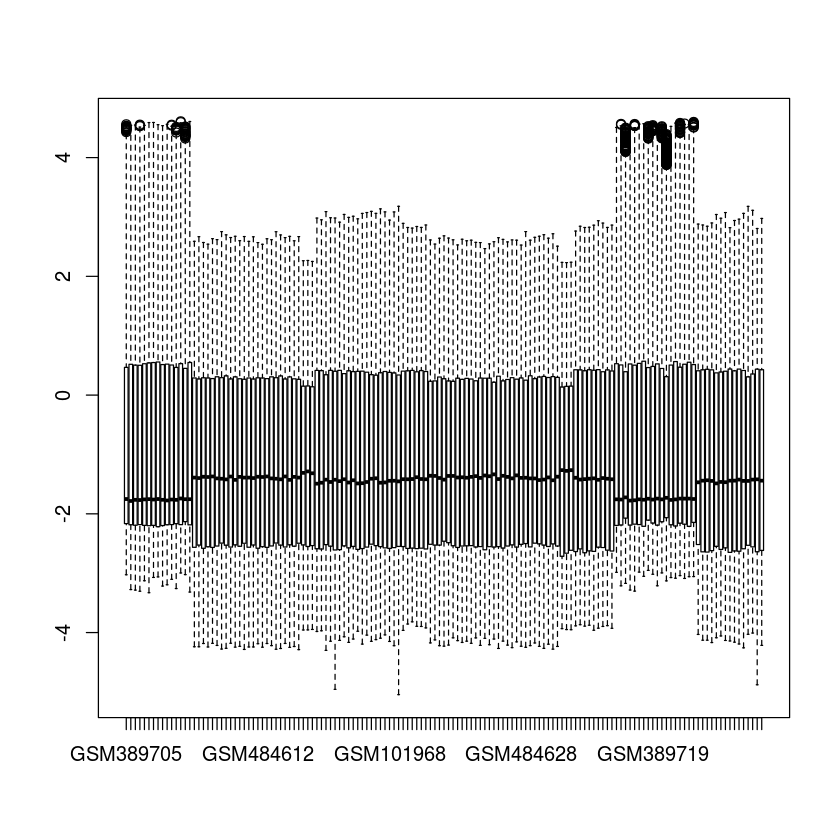
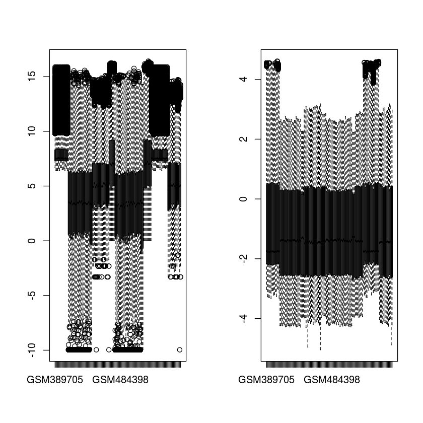

# Read Matrix Data
Read in the gene expression data sets.


```R
## Download microarray matrix files from GEO
```


```R
setwd("~/NLM_Reproducibility_Workshop/tb_and_arthritis/data")
```


```R
url1 <- "ftp://ftp.ncbi.nlm.nih.gov/geo/series/GSE54nnn/GSE54992/matrix/GSE54992_series_matrix.txt.gz"
utils::download.file(url1, destfile="GSE54992_series_matrix.txt.gz", mode="wb") 
```


```R
url2 <- "ftp://ftp.ncbi.nlm.nih.gov/geo/series/GSE19nnn/GSE19435/matrix/GSE19435_series_matrix.txt.gz"
utils::download.file(url2, destfile="GSE19435_series_matrix.txt.gz", mode="wb") 
```


```R
url3 <- "ftp://ftp.ncbi.nlm.nih.gov/geo/series/GSE15nnn/GSE15573/matrix/GSE15573_series_matrix.txt.gz"
utils::download.file(url3, destfile="GSE15573_series_matrix.txt.gz", mode="wb") 

```


```R
url4 <- "ftp://ftp.ncbi.nlm.nih.gov/geo/series/GSE19nnn/GSE19444/matrix/GSE19444_series_matrix.txt.gz"
utils::download.file(url1, destfile="GSE19444_series_matrix.txt.gz", mode="wb") 

```


```R
url5 <- "ftp://ftp.ncbi.nlm.nih.gov/geo/series/GSE19nnn/GSE19435/matrix/GSE19435_series_matrix.txt.gz"
utils::download.file(url1, destfile="GSE19435_series_matrix.txt.gz", mode="wb") 

```


```R
url6 <- "ftp://ftp.ncbi.nlm.nih.gov/geo/series/GSE65nnn/GSE65517/matrix/GSE65517_series_matrix.txt.gz"
utils::download.file(url1, destfile="GSE65517_series_matrix.txt.gz", mode="wb") 
```


```R
## Download and install different types of microarray annotation database files
```


```R
install.packages("BiocManager")
BiocManager::install("plyr")
BiocManager::install("annotate")
BiocManager::install("illuminaHumanv4.db")
BiocManager::install("hgu133plus2.db")
BiocManager::install("illuminaHumanv2.db")
BiocManager::install("illuminaHumanv3.db")

```


```R
library(annotate)
library(illuminaHumanv3.db)
library(illuminaHumanv2.db)
library(hgu133plus2.db)
library(illuminaHumanv4.db)
library(plyr)

## setup working directory
working.dir <- "~/NLM_Reproducibility_Workshop/tb_and_arthritis/working"
setwd(working.dir)

## read into matrix which was downloaded from GEO
dat.v2 <- read.delim("GSE15573_series_matrix_networkanalyst.txt")

## annotate microarray problesets 
id.v2 <- select(illuminaHumanv2.db, as.character(dat.v2[2:nrow(dat.v2),1]),
                c("SYMBOL","ENTREZID", "GENENAME"))

dat.v3.1 <- read.delim("GSE19435_series_matrix_networkanalyst.txt")
id.v3.1 <- select(illuminaHumanv3.db, as.character(dat.v3.1[2:nrow(dat.v3.1),1]),
                c("SYMBOL","ENTREZID", "GENENAME"))

dat.v3.2 <- read.delim("GSE19444_series_matrix_networkanalyst.txt")
id.v3.2 <- select(illuminaHumanv3.db, as.character(dat.v3.2[2:nrow(dat.v3.2),1]),
                  c("SYMBOL","ENTREZID", "GENENAME"))

dat.v4 <- read.delim("GSE65517_series_matrix_networkanalyst.txt")
id.v4 <- select(illuminaHumanv4.db, as.character(dat.v4[2:nrow(dat.v4),1]),
                c("SYMBOL","ENTREZID", "GENENAME"))

dat.plus2 <- read.delim("GSE4588_series_matrix_networkanalyst.txt")
id.plus2 <- select(hgu133plus2.db, as.character(dat.plus2[2:nrow(dat.plus2),1]),
                c("SYMBOL","ENTREZID", "GENENAME"))

dat.plus2.2 <- read.delim("GSE54992_series_matrix_networkanalyst.txt")
id.plus2.2 <- select(hgu133plus2.db, as.character(dat.plus2.2[2:nrow(dat.plus2.2),1]),
                c("SYMBOL","ENTREZID", "GENENAME"))

## merge data matrix with its annotation table by probeID
colnames(dat.v2)[1]=colnames(id.v2)[1]
dat.v2.all <- join(dat.v2,id.v2,by="PROBEID")

colnames(dat.v3.1)[1]=colnames(id.v3.1)[1]
dat.v3.1.all <- join(dat.v3.1,id.v3.1,by="PROBEID")

colnames(dat.v3.2)[1]=colnames(id.v3.2)[1]
dat.v3.2all <- join(dat.v3.2,id.v3.2,by="PROBEID")

colnames(dat.v4)[1]=colnames(id.v4)[1]
dat.v4.all <- join(dat.v4,id.v4,by="PROBEID")

colnames(dat.plus2)[1]=colnames(id.plus2)[1]
dat.plus2.all <- join(dat.plus2,id.plus2,by="PROBEID")

colnames(dat.plus2.2)[1]=colnames(id.plus2.2)[1]
dat.plus2.2.all <- join(dat.plus2.2,id.plus2.2,by="PROBEID")
```

    Loading required package: AnnotationDbi
    Loading required package: stats4
    Loading required package: BiocGenerics
    Loading required package: parallel
    
    Attaching package: ‘BiocGenerics’
    
    The following objects are masked from ‘package:parallel’:
    
        clusterApply, clusterApplyLB, clusterCall, clusterEvalQ,
        clusterExport, clusterMap, parApply, parCapply, parLapply,
        parLapplyLB, parRapply, parSapply, parSapplyLB
    
    The following objects are masked from ‘package:stats’:
    
        IQR, mad, sd, var, xtabs
    
    The following objects are masked from ‘package:base’:
    
        anyDuplicated, append, as.data.frame, basename, cbind, colnames,
        dirname, do.call, duplicated, eval, evalq, Filter, Find, get, grep,
        grepl, intersect, is.unsorted, lapply, Map, mapply, match, mget,
        order, paste, pmax, pmax.int, pmin, pmin.int, Position, rank,
        rbind, Reduce, rownames, sapply, setdiff, sort, table, tapply,
        union, unique, unsplit, which, which.max, which.min
    
    Loading required package: Biobase
    Welcome to Bioconductor
    
        Vignettes contain introductory material; view with
        'browseVignettes()'. To cite Bioconductor, see
        'citation("Biobase")', and for packages 'citation("pkgname")'.
    
    Loading required package: IRanges
    Loading required package: S4Vectors
    
    Attaching package: ‘S4Vectors’
    
    The following object is masked from ‘package:base’:
    
        expand.grid
    
    Loading required package: XML
    Loading required package: org.Hs.eg.db
    
    
    
    
    
    
    Attaching package: ‘plyr’
    
    The following object is masked from ‘package:IRanges’:
    
        desc
    
    The following object is masked from ‘package:S4Vectors’:
    
        rename
    
    'select()' returned 1:many mapping between keys and columns
    'select()' returned 1:many mapping between keys and columns
    'select()' returned 1:many mapping between keys and columns
    'select()' returned 1:many mapping between keys and columns
    'select()' returned 1:many mapping between keys and columns
    'select()' returned 1:many mapping between keys and columns
    'select()' returned 1:many mapping between keys and columns


# Sample Filtering
The paper used some inclusion criteria to select samples from each study. Samples without class labels are thus removed from further analyses.


```R
datasets <- list(dat.v2.all,dat.v3.1.all,dat.v3.2.all,dat.v4.all,dat.plus2.all,dat.plus2.2.all)
for (i in 1:length(datasets)) {
    dataset <- datasets[1]
    dataset <- dataset[which(is.na(dataset[1,])),]
    print(ncol(datasets[i]))
}
```


```R
getwd()
```


'/home/ubuntu/NLM_Reproducibility_Workshop/tb_and_arthritis/scripts'


```R
setwd("/home/ubuntu/NLM_Reproducibility_Workshop/tb_and_arthritis/data")
```


```R
library(limma)
```


```R
source("http://bioconductor.org/biocLite.R")
biocLite("affy","vsn")
```

    Bioconductor version 3.7 (BiocInstaller 1.30.0), ?biocLite for help
    A newer version of Bioconductor is available for this version of R,
      ?BiocUpgrade for help
    BioC_mirror: https://bioconductor.org
    Using Bioconductor 3.7 (BiocInstaller 1.30.0), R 3.6.0 (2019-04-26).
    Installing package(s) ‘affy’
    installation path not writeable, unable to update packages: boot, class,
      cluster, codetools, foreign, KernSmooth, lattice, MASS, Matrix, mgcv, nlme,
      nnet, spatial, survival


```R
library(vsn)
```

    Loading required package: Biobase
    Loading required package: BiocGenerics
    Loading required package: parallel
    
    Attaching package: ‘BiocGenerics’
    
    The following objects are masked from ‘package:parallel’:
    
        clusterApply, clusterApplyLB, clusterCall, clusterEvalQ,
        clusterExport, clusterMap, parApply, parCapply, parLapply,
        parLapplyLB, parRapply, parSapply, parSapplyLB
    
    The following object is masked from ‘package:limma’:
    
        plotMA
    
    The following objects are masked from ‘package:stats’:
    
        IQR, mad, sd, var, xtabs
    
    The following objects are masked from ‘package:base’:
    
        anyDuplicated, append, as.data.frame, basename, cbind, colnames,
        dirname, do.call, duplicated, eval, evalq, Filter, Find, get, grep,
        grepl, intersect, is.unsorted, lapply, Map, mapply, match, mget,
        order, paste, pmax, pmax.int, pmin, pmin.int, Position, rank,
        rbind, Reduce, rownames, sapply, setdiff, sort, table, tapply,
        union, unique, unsplit, which, which.max, which.min
    
    Welcome to Bioconductor
    
        Vignettes contain introductory material; view with
        'browseVignettes()'. To cite Bioconductor, see
        'citation("Biobase")', and for packages 'citation("pkgname")'.
    
    Registered S3 methods overwritten by 'ggplot2':
      method         from 
      [.quosures     rlang
      c.quosures     rlang
      print.quosures rlang


```R
library(ggplot2)
```


```R
# Read into meta files
dat <- read.delim("merged.dataset.txt")
dim(dat)
head(dat)
class(dat)
```


<ol class=list-inline>
	<li>18206</li>
	<li>141</li>
</ol>


<table>
<caption>A data.frame: 6 × 141</caption>
<thead>
	<tr><th></th><th scope=col>GSM389703</th><th scope=col>GSM389704</th><th scope=col>GSM389705</th><th scope=col>GSM389706</th><th scope=col>GSM389707</th><th scope=col>GSM389708</th><th scope=col>GSM389709</th><th scope=col>GSM389710</th><th scope=col>GSM389711</th><th scope=col>GSM389712</th><th scope=col>⋯</th><th scope=col>GSM1327531</th><th scope=col>GSM1327533</th><th scope=col>GSM1327535</th><th scope=col>GSM1327540</th><th scope=col>GSM1327541</th><th scope=col>GSM1327542</th><th scope=col>GSM1327544</th><th scope=col>GSM1327546</th><th scope=col>GSM1327549</th><th scope=col>GSM1327550</th></tr>
	<tr><th></th><th scope=col>&lt;fct&gt;</th><th scope=col>&lt;fct&gt;</th><th scope=col>&lt;fct&gt;</th><th scope=col>&lt;fct&gt;</th><th scope=col>&lt;fct&gt;</th><th scope=col>&lt;fct&gt;</th><th scope=col>&lt;fct&gt;</th><th scope=col>&lt;fct&gt;</th><th scope=col>&lt;fct&gt;</th><th scope=col>&lt;fct&gt;</th><th scope=col>⋯</th><th scope=col>&lt;fct&gt;</th><th scope=col>&lt;fct&gt;</th><th scope=col>&lt;fct&gt;</th><th scope=col>&lt;fct&gt;</th><th scope=col>&lt;fct&gt;</th><th scope=col>&lt;fct&gt;</th><th scope=col>&lt;fct&gt;</th><th scope=col>&lt;fct&gt;</th><th scope=col>&lt;fct&gt;</th><th scope=col>&lt;fct&gt;</th></tr>
</thead>
<tbody>
	<tr><th scope=row>#CLASS</th><td>RA       </td><td>RA       </td><td>Healthy  </td><td>RA       </td><td>Healthy  </td><td>RA       </td><td>Healthy  </td><td>Healthy  </td><td>RA       </td><td>Healthy  </td><td>⋯</td><td>TB         </td><td>TB         </td><td>TB         </td><td>TB         </td><td>Healthy     </td><td>Healthy    </td><td>Healthy     </td><td>Healthy    </td><td>Healthy    </td><td>Healthy    </td></tr>
	<tr><th scope=row>A1CF</th><td> 7.141797</td><td> 7.197045</td><td> 7.122337</td><td> 7.204903</td><td> 7.189596</td><td> 7.130171</td><td> 7.042596</td><td> 7.231972</td><td> 7.227221</td><td> 7.287982</td><td>⋯</td><td> 4.02235335</td><td> 4.51622020</td><td> 2.85592080</td><td> 4.49177415</td><td> 4.406767750</td><td> 5.57438430</td><td> 5.318372000</td><td> 5.03258470</td><td> 5.20997165</td><td> 5.22182185</td></tr>
	<tr><th scope=row>A2M</th><td> 7.029003</td><td> 7.101189</td><td> 7.096027</td><td> 7.008570</td><td> 6.996296</td><td> 7.226256</td><td> 7.125058</td><td> 7.194374</td><td> 7.143266</td><td> 7.285384</td><td>⋯</td><td> 6.02278985</td><td> 4.07172385</td><td> 4.90828205</td><td> 6.31538965</td><td> 6.036567950</td><td> 5.87433620</td><td> 5.158579000</td><td> 6.26011845</td><td> 5.47088145</td><td> 6.20920705</td></tr>
	<tr><th scope=row>A2ML1</th><td> 7.575453</td><td> 7.597774</td><td> 7.717223</td><td> 7.927268</td><td> 7.408724</td><td> 7.583378</td><td> 7.642665</td><td> 7.595066</td><td> 7.627102</td><td> 7.489733</td><td>⋯</td><td> 5.71163700</td><td> 4.86576620</td><td> 3.53536070</td><td> 4.53559050</td><td> 3.854281250</td><td> 3.64424540</td><td> 3.364639650</td><td> 4.76493950</td><td> 3.78714480</td><td> 2.92730750</td></tr>
	<tr><th scope=row>A4GALT</th><td> 7.246332</td><td> 7.091080</td><td> 7.216745</td><td> 7.240897</td><td> 7.107234</td><td> 7.248818</td><td> 7.088888</td><td> 7.188603</td><td> 7.143010</td><td> 7.308314</td><td>⋯</td><td> 6.25344470</td><td> 4.41422700</td><td> 4.06841950</td><td> 5.36375500</td><td> 5.151473500</td><td> 5.66670130</td><td> 2.955237200</td><td> 6.26900500</td><td> 3.58906750</td><td> 2.78438200</td></tr>
	<tr><th scope=row>A4GNT</th><td> 7.480316</td><td> 7.478925</td><td> 7.369129</td><td> 7.530114</td><td> 7.534178</td><td> 7.390891</td><td> 7.447209</td><td> 7.323019</td><td> 7.483748</td><td> 7.329446</td><td>⋯</td><td> 5.42316100</td><td> 6.60445500</td><td> 4.83532240</td><td> 6.46519800</td><td> 6.735679600</td><td> 4.68708040</td><td> 4.022444700</td><td> 6.59867600</td><td> 6.96301360</td><td> 6.53558700</td></tr>
</tbody>
</table>


'data.frame'


```R
dat.num <- apply(dat[-1,],2,as.numeric)
dim(dat.num)
```


<ol class=list-inline>
	<li>18205</li>
	<li>141</li>
</ol>


```R
grp <- c("Healthy","TB","RA")
grp.all <- c(which(dat[1,]==grp[1]),which(dat[1,]==grp[2]),which(dat[1,]==grp[3]))
length(grp.all)
dat.num.rord <- dat.num[,grp.all]
rownames(dat.num.rord)=rownames(dat)[-1]
col <- rep(c('green','red','blue'),c(length(which(dat[1,]==grp[1])),
length(which(dat[1,]==grp[2])),length(which(dat[1,]==grp[3]))))
```


141


```R
# normalize crossing all batches samples
dat.norm <- normalizeVSN(dat.num.rord)
```


```R
head(dat.norm)
```


<table>
<caption>A matrix: 6 × 141 of type dbl</caption>
<thead>
	<tr><th></th><th scope=col>GSM389705</th><th scope=col>GSM389707</th><th scope=col>GSM389709</th><th scope=col>GSM389710</th><th scope=col>GSM389712</th><th scope=col>GSM389713</th><th scope=col>GSM389715</th><th scope=col>GSM389718</th><th scope=col>GSM389720</th><th scope=col>GSM389723</th><th scope=col>⋯</th><th scope=col>GSM101884</th><th scope=col>GSM101885</th><th scope=col>GSM101886</th><th scope=col>GSM102703</th><th scope=col>GSM102704</th><th scope=col>GSM102705</th><th scope=col>GSM102706</th><th scope=col>GSM102707</th><th scope=col>GSM102708</th><th scope=col>GSM102709</th></tr>
</thead>
<tbody>
	<tr><th scope=row>A1CF</th><td>-2.461394</td><td>-2.356986</td><td>-2.587458</td><td>-2.326891</td><td>-2.267994</td><td>-2.3792052</td><td>-2.4432890</td><td>-2.4280191</td><td>-2.569391</td><td>-2.485236</td><td>⋯</td><td>-3.184788</td><td>-2.0381566</td><td>-3.103178</td><td>-2.3925198</td><td>-3.460059</td><td>-2.3364914</td><td>-2.2054422</td><td>-1.9507142</td><td>-2.2974032</td><td>-2.785251</td></tr>
	<tr><th scope=row>A2M</th><td>-2.500844</td><td>-2.640260</td><td>-2.468143</td><td>-2.387549</td><td>-2.272424</td><td>-2.4894340</td><td>-2.4364424</td><td>-2.4821393</td><td>-2.626212</td><td>-2.295681</td><td>⋯</td><td>-3.026328</td><td>-2.0940404</td><td>-2.355889</td><td>-2.4841404</td><td>-1.973206</td><td>-3.2994130</td><td>-1.7789308</td><td>-2.5462753</td><td>-2.5513615</td><td>-2.605454</td></tr>
	<tr><th scope=row>A2ML1</th><td>-1.225015</td><td>-1.966195</td><td>-1.452122</td><td>-1.604676</td><td>-1.885406</td><td>-1.6422873</td><td>-1.7271878</td><td>-1.7699730</td><td>-1.645435</td><td>-1.313775</td><td>⋯</td><td>-3.207625</td><td>-2.6456511</td><td>-2.340616</td><td>-2.7969383</td><td>-3.012654</td><td>-3.0586973</td><td>-2.5425815</td><td>-2.3269974</td><td>-3.0369349</td><td>-2.590921</td></tr>
	<tr><th scope=row>A4GALT</th><td>-2.311618</td><td>-2.483689</td><td>-2.521552</td><td>-2.396670</td><td>-2.232927</td><td>-2.2345093</td><td>-2.1577899</td><td>-2.0392966</td><td>-2.529866</td><td>-2.409896</td><td>⋯</td><td>-1.648894</td><td>-1.9227980</td><td>-2.609918</td><td>-2.1919224</td><td>-2.430139</td><td>-3.2209430</td><td>-3.3795673</td><td>-1.0278439</td><td>-2.6605926</td><td>-1.946874</td></tr>
	<tr><th scope=row>A4GNT</th><td>-2.038587</td><td>-1.699258</td><td>-1.900798</td><td>-2.170456</td><td>-2.195716</td><td>-1.9489714</td><td>-1.8309328</td><td>-1.9534459</td><td>-2.182871</td><td>-1.583436</td><td>⋯</td><td>-1.409749</td><td>-3.0139655</td><td>-2.074730</td><td>-2.0876437</td><td>-2.351640</td><td>-3.1646134</td><td>-1.4728106</td><td>-1.1912784</td><td>-2.6023795</td><td>-1.806118</td></tr>
	<tr><th scope=row>AAAS</th><td>-1.045208</td><td>-1.594219</td><td>-1.287075</td><td>-1.073887</td><td>-1.316088</td><td>-0.7342412</td><td>-0.9681738</td><td>-0.9123387</td><td>-1.347118</td><td>-1.211588</td><td>⋯</td><td>-2.464002</td><td>-0.3043316</td><td>-1.151105</td><td>-0.6012513</td><td>-0.886129</td><td>-0.2309443</td><td>-0.9986175</td><td>-0.8256078</td><td>-0.6048712</td><td>-1.144839</td></tr>
</tbody>
</table>


```R
boxplot(dat.norm)
```





```R
BiocManager::install("affyPLM")

library(affyPLM)
```

    Bioconductor version 3.9 (BiocManager 1.30.4), R 3.6.0 (2019-04-26)
    Installing package(s) 'affyPLM'
    also installing the dependencies ‘XVector’, ‘Biostrings’, ‘gcrma’
    
    installation path not writeable, unable to update packages: boot, class,
      cluster, codetools, foreign, KernSmooth, lattice, MASS, Matrix, mgcv, nlme,
      nnet, spatial, survival
    Update old packages: 'affy', 'affyio', 'vsn', 'zlibbioc'
    Loading required package: affy
    Loading required package: gcrma
    Loading required package: preprocessCore


```R
dat.norm.scale=normalize.scaling(dat.num.rord,trim=0.02, baseline=-0.5, log.scalefactors=TRUE)
```


```R
par(mfrow=c(1,2))
boxplot(dat.num.rord)
boxplot(dat.norm)
```





```R
?normalize.scaling
```
